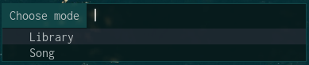
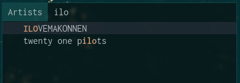
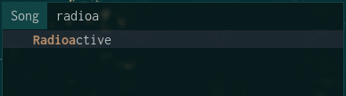

# mpd-menu


## Description
Simple mpd client in rofi.

## Screenshots






## Installation
### From AUR (Arch Linux)
```shell
yay -S rofi-mpd
```

### From source
### Dependencies
Package | Description
:--- | :---
rofi | application menu, dmenu replacement
mpd | music player daemon
mpc | CLI client for mpd

### Install dependencies
#### Arch Linux
```
sudo pacman -S --needed rofi mpd mpc
```
#### Debian/Ubuntu
```
sudo apt install rofi mpd mpc
```
#### Fedora
```
sudo dnf install rofi mpd mpc
```
#### openSUSE
```
sudo zypper in rofi mpd mpc
```
### Clone repository
```
git clone https://github.com/samedamci/rofi-mpd
```

### Usage
Use `./rofi-mpd` with `--help` or `-h` flag to get help.
